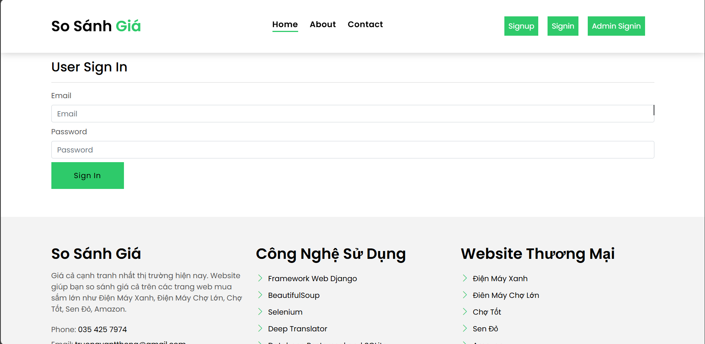

# Web So Sánh Giá
- Web so sánh giá là một công cụ trực tuyến cho phép người dùng so sánh giá cả của cùng một sản phẩm được bán trên nhiều nhà bán lẻ khác nhau. Mục tiêu của các trang web này là giúp người tiêu dùng tìm được nơi bán sản phẩm với giá tốt nhất, tiết kiệm thời gian và tiền bạc.
- Với sự phát triển của công nghệ thông tin, việc so sánh giá cả trở nên dễ dàng hơn bao giờ hết. Chúng tôi sử dụng công nghệ web scraping để lấy dữ liệu từ các trang web bán hàng lớn như Amazon, Điện máy xanh, ... và hiển thị dữ liệu đó trên trang web của chúng tôi. Để giúp người dùng tiết kiệm thời gian và tiền bạc khi mua sắm.
-  Công nghệ sử dụng: Django, Python, HTML, CSS, JavaScript, Bootstrap, Web scraping, PostgreSQL.

## Screenshots of the application

* Home page


* Signup Page


* Login Page


* Contract Page


* Update Profile Page


* Search Page


# Hướng dẫn sử dụng
## Bước 1: Tạo môi trường ảo Python và Cài đặt thư viện 
`windows`
Chạy file create_venv.bat để tạo môi trường ảo Python và cài đặt các thư viện cần thiết.
```bash
create_venv.bat
 ```
`MacOS`
```bash
python3 -m venv .venv
source .venv/bin/activate
pip install -r requirements.txt
```

## Bước 2. Để thiết lập kết nối tới database, bạn cần chỉnh sửa file `settings.py` trong project của mình.

### Nếu bạn sử dụng PostgreSQL:

```python
DATABASES = {
    'default': {
        'ENGINE': 'django.db.backends.postgresql_psycopg2',
        'NAME': 'pricecompare',
        'USER': 'postgres',
        'PASSWORD': 'admin',
        'HOST': 'localhost',
        'PORT': '5432',
    }
}
```
Trong đó:

- `ENGINE`: Loại database backend sử dụng (trong trường hợp này là PostgreSQL).
- `NAME`: Tên của database.
- `USER`: Tên đăng nhập để truy cập database.
- `PASSWORD`: Mật khẩu để truy cập database.
- `HOST`: Địa chỉ của database server (trong trường hợp này là localhost).
- `PORT`: Cổng kết nối tới database (trong trường hợp này là 5432 cho PostgreSQL).

Bạn có thể sửa file **settings.py** trong project của mình để thêm các thông tin kết nối tới database của bạn. Lưu ý rằng, bạn cần phải cài đặt driver tương ứng cho database của mình (ví dụ: psycopg2 cho PostgreSQL) để Django có thể kết nối và thao tác với database.

### Nếu bạn sử dụng SQLite:

```python
DATABASES = {
    'default': {
        'ENGINE': 'django.db.backends.sqlite3',
        'NAME': BASE_DIR / 'db.sqlite3',
    }
}
```

## Bước 3: Cài đặt các package chạy server
`Ta vào thư mục DjPriceCompare:`
```bash
cd DjPriceCompare
```

`Chạy lệnh này để cài package:`
```bash
make.bat
```

## Bước 4: Chạy chương trình
`Sử dụng file` **run.bat**
```bash
run.bat
```
Sau khi chạy xong, bạn có thể truy cập trang web của mình trên trình duyệt với địa chỉ:
```bash
http://127.0.0.1:8000/
```
